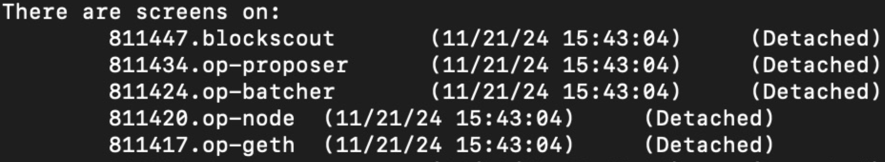

# opup, one-stop installation tool for OP Stack

# Usage

To start all processes, just run `just up`.
 
If anything goes wrong, it'll stop immediately, indicating the exact line that's triggering it.

If everything goes well, it'll spin up these processes:

(Each process is managed in a separate [screen](https://linuxize.com/post/how-to-use-linux-screen/) session.)

To show all L1 contracts, just run `just l1`.

To shut down all processes, just run `just down`.

To nuke all data, just run `just nuke`.

# Service Ports

1. `op-geth`: rpc port is `8545`.
2. `op-node`: rpc port is `8547`.
3. `da-server`: rpc port is `8888`.
4. `blockscout`: frontend port is `80`.
